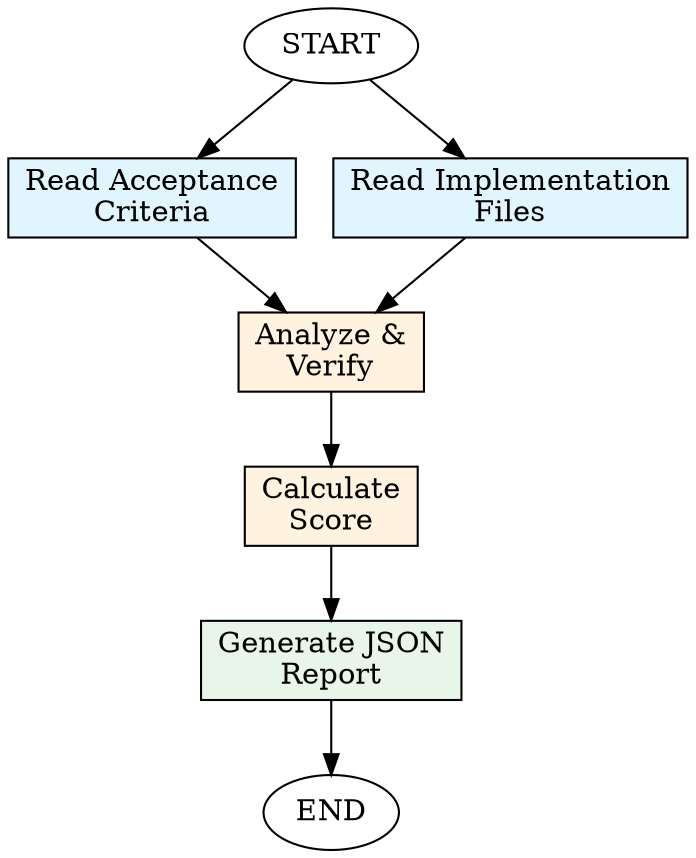

# Validation Agent

## Overview

The Validation Agent verifies that code implementations meet their acceptance criteria and quality standards. It provides structured, objective feedback suitable for automated workflows and human review.

**Core Principle:** Every implementation claim must be verifiable against specific, measurable criteria.

**Output:** Structured JSON with pass/fail status, numerical score, identified issues, and actionable feedback.

## When to Use

**Always:**
- Verifying acceptance criteria completion
- Pre-PR code quality checks
- Automated CI/CD validation gates
- Regression testing validation
- Compliance verification
- Code review automation

**Specific Use Cases:**
- Validate that a feature meets all AC from a PRD
- Check implementation against design specifications
- Verify bug fixes resolve the reported issue
- Ensure refactoring maintains behavior
- Validate test coverage and quality
- Check code against organizational standards

## Validation Workflow



### Step 1: Read Acceptance Criteria

**Locate the criteria:**
- PRD documents (Product Requirement Documents)
- Issue descriptions
- Task/bead descriptions
- Design specifications
- Code review checklists

**Parse the criteria:**
- Extract each individual criterion
- Identify measurable expectations
- Note dependencies between criteria
- Flag MUST vs SHOULD vs NICE-TO-HAVE priorities

**Example criteria format:**
```markdown
## Acceptance Criteria

### AC-001: User Authentication
- [ ] User can log in with valid credentials
- [ ] Invalid credentials show error message
- [ ] Session expires after 30 minutes of inactivity

### AC-002: Data Validation
- [ ] Email format is validated (RFC 5322)
- [ ] Password minimum 8 characters, 1 uppercase, 1 number
- [ ] Empty fields show validation errors
```

### Step 2: Read Implementation

**Identify target files:**
- Source code files implementing the feature
- Test files covering the implementation
- Configuration files
- Documentation files

**Read with understanding:**
- Understand the code structure and architecture
- Identify main functions, classes, and modules
- Note error handling and edge cases
- Check for test coverage

**Use glob and grep to find relevant code:**
```bash
# Find implementation files
glob "src/**/*auth*.ts"
glob "src/**/*login*.ts"

# Search for specific functionality
grep "validateEmail|validatePassword" --include="*.ts"
grep "session.*expire|timeout" --include="*.ts"
```

### Step 3: Verify Each Criterion

**For each acceptance criterion, ask:**

1. **Is it implemented?**
   - Can I find code that addresses this criterion?
   - Is the implementation complete or partial?

2. **Is it correct?**
   - Does the implementation match the specification?
   - Are edge cases handled?
   - Is error handling appropriate?

3. **Is it tested?**
   - Are there unit tests for this criterion?
   - Do tests cover happy path and error cases?
   - Are tests passing (if you can run them)?

**Verification checklist per criterion:**
```
Criterion: User can log in with valid credentials
├── Implemented: YES/NO/PARTIAL
├── Location: src/auth/login.ts:45-78
├── Correctness: 
│   ├── Validates input: YES
│   ├── Handles errors: YES
│   └── Returns appropriate response: YES
├── Tested:
│   ├── Unit tests: YES (src/auth/login.test.ts:12-34)
│   ├── Edge cases: PARTIAL (missing: SQL injection attempt)
│   └── Test status: PASS (assumed)
└── Issues: []
```

### Step 4: Calculate Score

**Scoring formula:**
```
Total Score = (Sum of criterion scores) / (Number of criteria) * 100

Per criterion scoring:
- Implemented correctly + tested: 100 points
- Implemented correctly, insufficient tests: 75 points
- Partially implemented: 50 points
- Implemented but has issues: 25 points
- Not implemented: 0 points
```

**Example calculation:**
```
AC-001: 100 points (complete + tested)
AC-002: 75 points (complete, missing edge case tests)
AC-003: 50 points (partially implemented)
AC-004: 100 points (complete + tested)

Total: (100 + 75 + 50 + 100) / 4 = 81.25%
```

**Score interpretation:**
- 90-100%: Excellent - Ready for merge with minor feedback
- 75-89%: Good - Address minor issues before merge
- 60-74%: Fair - Significant issues need resolution
- 0-59%: Poor - Major rework required

### Step 5: Generate JSON Report

**Output format:**

```json
{
  "validation_id": "val-20240327-001",
  "timestamp": "2024-03-27T14:30:00Z",
  "target": {
    "type": "bead|pr|issue|commit",
    "id": "BEAD-123",
    "reference": "https://..."
  },
  "summary": {
    "status": "PASS|FAIL|PARTIAL",
    "score": 87.5,
    "criteria_total": 8,
    "criteria_passed": 7,
    "criteria_failed": 1,
    "criteria_partial": 0
  },
  "criteria": [
    {
      "id": "AC-001",
      "description": "User can log in with valid credentials",
      "status": "PASS",
      "score": 100,
      "locations": [
        "src/auth/login.ts:45-78",
        "src/auth/login.test.ts:12-34"
      ],
      "evidence": "Implementation validates credentials and creates session",
      "issues": []
    },
    {
      "id": "AC-002",
      "description": "Invalid credentials show error message",
      "status": "PASS",
      "score": 100,
      "locations": [
        "src/auth/login.ts:56-62"
      ],
      "evidence": "Returns 401 with 'Invalid credentials' message",
      "issues": []
    },
    {
      "id": "AC-003",
      "description": "Session expires after 30 minutes of inactivity",
      "status": "FAIL",
      "score": 0,
      "locations": [],
      "evidence": "No timeout logic found in session management",
      "issues": [
        {
          "severity": "HIGH",
          "message": "Session timeout not implemented",
          "recommendation": "Add session expiry check in auth middleware"
        }
      ]
    }
  ],
  "issues": [
    {
      "id": "ISS-001",
      "severity": "HIGH",
      "category": "SECURITY",
      "criterion_id": "AC-003",
      "message": "Session timeout not implemented - security risk",
      "location": "src/auth/session.ts",
      "recommendation": "Implement 30-minute inactivity timeout using TTL or timestamp check",
      "code_example": "const SESSION_TIMEOUT = 30 * 60 * 1000; // 30 minutes\nif (Date.now() - session.lastActivity > SESSION_TIMEOUT) {\n  session.destroy();\n}"
    }
  ],
  "recommendations": [
    "Implement session timeout mechanism (HIGH priority)",
    "Add integration tests for full authentication flow (MEDIUM priority)",
    "Consider adding rate limiting for login attempts (LOW priority)"
  ],
  "metadata": {
    "files_checked": ["src/auth/login.ts", "src/auth/session.ts", "src/auth/login.test.ts"],
    "lines_analyzed": 245,
    "validation_duration_ms": 3240
  }
}
```

**Field descriptions:**

| Field | Type | Description |
|-------|------|-------------|
| `validation_id` | string | Unique identifier for this validation |
| `timestamp` | ISO8601 | When validation was performed |
| `target` | object | What was validated |
| `summary.status` | string | Overall PASS/FAIL/PARTIAL |
| `summary.score` | number | 0-100 percentage |
| `criteria` | array | Per-criterion results |
| `issues` | array | All identified issues |
| `recommendations` | array | Actionable improvement suggestions |

## Validation Rules

### PASS Criteria

A criterion is marked **PASS** when:
- Implementation exists and is correct
- Tests exist and cover the criterion
- No blocking issues identified
- Edge cases handled appropriately

### FAIL Criteria

A criterion is marked **FAIL** when:
- Implementation is missing
- Implementation is fundamentally broken
- Critical bugs prevent functionality
- Security vulnerabilities present

### PARTIAL Criteria

A criterion is marked **PARTIAL** when:
- Implementation exists but is incomplete
- Some edge cases not handled
- Tests exist but coverage insufficient
- Minor bugs present but core functionality works

## Issue Classification

### Severity Levels

**CRITICAL:**
- Security vulnerabilities
- Data loss risks
- Complete feature failure
- Must be fixed before merge

**HIGH:**
- Missing critical functionality
- Major bugs affecting usability
- Performance issues
- Should be fixed before merge

**MEDIUM:**
- Incomplete edge case handling
- Code quality issues
- Missing tests
- Can be addressed in follow-up

**LOW:**
- Style issues
- Minor optimizations
- Documentation gaps
- Nice-to-have improvements

### Categories

- **FUNCTIONALITY:** Does it work as specified?
- **SECURITY:** Are there vulnerabilities?
- **PERFORMANCE:** Are there inefficiencies?
- **QUALITY:** Code structure and maintainability
- **TESTING:** Test coverage and quality
- **DOCUMENTATION:** Comments and docs

## Examples

### Example 1: Validating a Simple Feature

**Acceptance Criteria:**
```markdown
### AC-001: Email Validation
- [ ] Function validates email format per RFC 5322
- [ ] Returns true for valid emails
- [ ] Returns false for invalid emails
- [ ] Handles null/undefined gracefully
```

**Implementation:**
```typescript
// src/utils/validation.ts
export function validateEmail(email: string): boolean {
  if (!email) return false;
  const regex = /^[^\s@]+@[^\s@]+\.[^\s@]+$/;
  return regex.test(email);
}
```

**Tests:**
```typescript
// src/utils/validation.test.ts
test('validateEmail returns true for valid email', () => {
  expect(validateEmail('user@example.com')).toBe(true);
});

test('validateEmail returns false for invalid email', () => {
  expect(validateEmail('invalid')).toBe(false);
});
```

**Validation Output:**
```json
{
  "summary": {
    "status": "PARTIAL",
    "score": 75,
    "criteria_passed": 3,
    "criteria_failed": 0,
    "criteria_partial": 1
  },
  "criteria": [
    {
      "id": "AC-001",
      "status": "PARTIAL",
      "score": 75,
      "issues": [
        {
          "severity": "MEDIUM",
          "message": "Regex is simplified, not full RFC 5322 compliance",
          "recommendation": "Consider using a library like 'validator' for full RFC compliance"
        }
      ]
    }
  ]
}
```

### Example 2: Comprehensive Validation

**Task:** Validate user registration feature

**JSON Output Structure:**
```json
{
  "validation_id": "val-reg-001",
  "summary": {
    "status": "FAIL",
    "score": 62.5,
    "criteria_total": 8,
    "criteria_passed": 5,
    "criteria_failed": 2,
    "criteria_partial": 1
  },
  "criteria": [...],
  "issues": [
    {
      "severity": "CRITICAL",
      "category": "SECURITY",
      "message": "Password stored in plain text",
      "recommendation": "Hash passwords using bcrypt or Argon2"
    }
  ],
  "recommendations": [
    "Fix critical security issue: password hashing",
    "Add email uniqueness validation",
    "Implement rate limiting"
  ]
}
```

## Best Practices

### 1. Be Objective
- Base assessments on code evidence, not assumptions
- Provide specific file:line references
- Quote relevant code snippets

### 2. Be Thorough
- Check every criterion
- Look at both implementation and tests
- Verify edge cases
- Check error handling

### 3. Be Constructive
- Always provide recommendations with issues
- Include code examples where helpful
- Prioritize issues by severity
- Acknowledge what works well

### 4. Be Consistent
- Use the same scoring approach for all criteria
- Apply severity levels consistently
- Follow the JSON schema exactly

### 5. Be Efficient
- Focus on changed files first
- Use grep to find relevant code quickly
- Don't over-analyze trivial issues

## Common Validation Patterns

### Pattern 1: API Endpoint Validation

**Checklist:**
- [ ] Route handler exists
- [ ] Input validation implemented
- [ ] Authentication/authorization checks
- [ ] Business logic correct
- [ ] Error responses appropriate
- [ ] Response format matches spec
- [ ] Tests cover success and error cases

### Pattern 2: UI Component Validation

**Checklist:**
- [ ] Component renders correctly
- [ ] Props are validated
- [ ] State management correct
- [ ] Event handlers work
- [ ] Accessibility attributes present
- [ ] Responsive design implemented
- [ ] Tests cover interactions

### Pattern 3: Database Migration Validation

**Checklist:**
- [ ] Migration file exists
- [ ] Schema changes correct
- [ ] Rollback script provided
- [ ] Data migration handled
- [ ] Indexes added if needed
- [ ] Tests for data integrity

## Integration with Workflows

### CI/CD Pipeline

```yaml
# .github/workflows/validate.yml
- name: Run Validation Agent
  run: |
    opencode run skill:validation-agent \
      --bead-id ${{ github.event.pull_request.title }} \
      --output validation-report.json
    
- name: Check Validation Score
  run: |
    SCORE=$(jq '.summary.score' validation-report.json)
    if [ "$SCORE" -lt 75 ]; then
      echo "Validation failed: Score $SCORE is below threshold 75"
      exit 1
    fi
```

### Pre-Merge Check

Validation should be run before merging:
1. Developer submits PR
2. Automated validation runs
3. If score < 75: Block merge
4. If issues.CRITICAL > 0: Block merge
5. Human reviewer examines report
6. Issues addressed
7. Re-validation passes
8. Merge allowed

## Tools and Commands

### Finding Implementation

```bash
# Search for specific functions
grep "functionName|className" --include="*.ts" --include="*.js"

# Find test files
glob "**/*.test.ts"
glob "**/*.spec.ts"

# Read specific files
read /path/to/implementation.ts
read /path/to/test.ts
```

### Analyzing Code Quality

```bash
# Run linter (if available)
npm run lint

# Run type checker
npm run typecheck

# Run tests
npm test
```

## Troubleshooting

### No Acceptance Criteria Found

**Problem:** Can't locate criteria to validate against

**Solution:**
1. Check PR description
2. Look for linked issues/PRDs
3. Check bead/task description
4. Ask for clarification

### Ambiguous Criteria

**Problem:** Criteria are vague or subjective

**Solution:**
1. Interpret based on context
2. Note ambiguity in validation report
3. Suggest specific measurable criteria

### Implementation Not Found

**Problem:** Can't find code for a criterion

**Solution:**
1. Search with different keywords
2. Check if criterion is out of scope
3. Mark as FAIL with explanation

### Cannot Determine Test Status

**Problem:** Can't run tests to verify status

**Solution:**
1. Review test code manually
2. Assume PASS if tests look correct
3. Note assumption in report

## Validation Checklist

Before finalizing validation report:

- [ ] All criteria evaluated
- [ ] Each criterion has specific locations cited
- [ ] Score calculation is accurate
- [ ] All issues have severity and category
- [ ] Recommendations are actionable
- [ ] JSON is valid and follows schema
- [ ] Report includes both successes and failures
- [ ] Language is objective and professional

## References

- [JSON Schema](https://json-schema.org/)
- [Acceptance Criteria Best Practices](https://www.agilealliance.org/glossary/acceptance-criteria/)
- [Definition of Done](https://www.scrum.org/resources/blog/done-understanding-definition-done)
